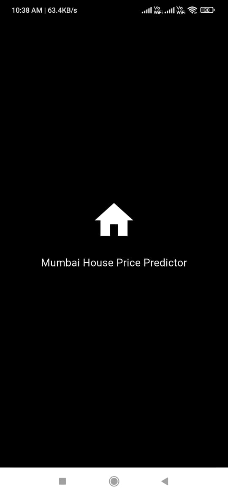
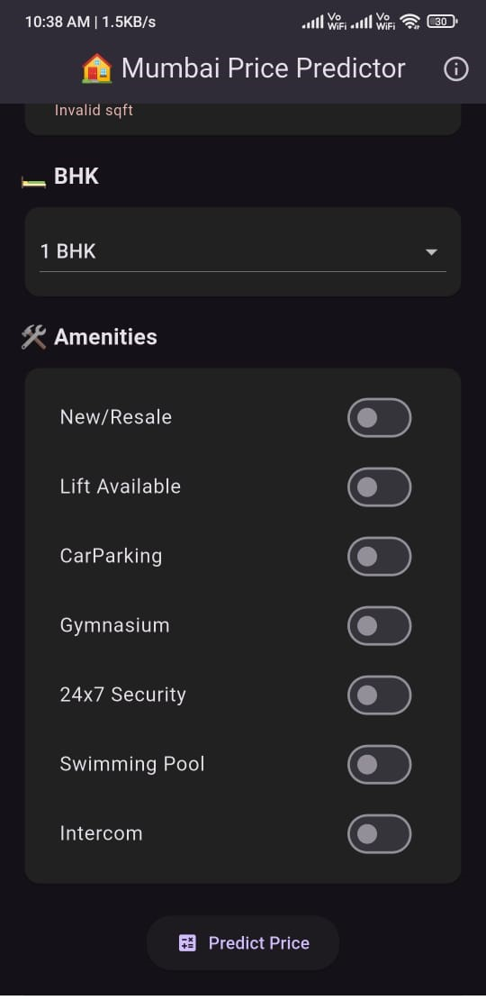
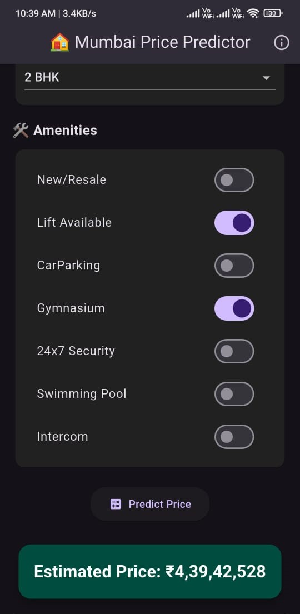

# 🏡 Mumbai House Price Predictor

A full-stack machine learning Android app that predicts house prices in Mumbai based on user inputs like location, BHK, square footage, and amenities — adjusted for 13.5% annual inflation over 7 years.

---

## 🚀 Live API

🌍 [https://mumbai-house-app.onrender.com](https://mumbai-house-app.onrender.com)  
**Try hitting `/predict` endpoint with POST data in JSON format**

---

## 📱 App Features

- 🔮 Predicts house price based on 10+ features  
- 📍 Dropdown with top 20 Mumbai locations  
- 🛏️ BHK & Square Footage input with validation  
- ✅ Amenities selection (gym, lift, parking, etc.)  
- 🧠 ML Model with `Random Forest` & `log transform`  
- 💸 Inflation-adjusted predictions (13.5% over 7 years)  
- 🌙 Dark mode, splash screen, haptic feedback  
- 🧭 Fully mobile optimized using Flutter + GetX  

---

## 🛠 Tech Stack

| Layer        | Technology                |
|--------------|---------------------------|
| 📱 Frontend  | Flutter (Android) + GetX  |
| 🧠 ML Model  | Scikit-learn (Random Forest) |
| 🔌 Backend   | Flask API                 |
| ☁️ Hosting   | Render.com                |
| 🔣 Format    | Indian currency (₹12,34,000) |

---

## 🧠 How it Works

1. User selects location, BHK, and amenities.  
2. Data is one-hot encoded and sent to Flask API.  
3. Backend uses a trained Random Forest model to predict `log(price)`.  
4. Final prediction is adjusted for **7 years of 13.5% inflation**.  
5. Result is shown in the app in Indian number format.  

---

## 📸 Screenshots

  
  
  

---

## 📂 Folder Structure (optional)

lib/ ├── main.dart ├── controller.dart └── ui/ ├── home_screen.dart └── splash_screen.dart assets/ └── icon.png 

---
## 📲 Download the App

Scan the QR code to install the APK:

Or [Click here to download](https://drive.google.com/file/d/1dQ6B7i0p70hfa9G5TctLKgTlV6ro9-1q/view?usp=drive_link)

## 🙌 Acknowledgements

- Inspired by the Mumbai real estate market
- Data cleaned & modeled with care for realism
- Thanks to all testers who validated predictions from real areas

---

## 🧑‍💻 Author

**Made with ❤️ by SaranshDataAI**

